# System Architecture — Multimodal Image Retrieval (SimCLR + CLIP)

> End-to-end documentation: data → preprocessing → training → FAISS indexing → retrieval → evaluation.

---

## Table of Contents

1. [High-Level Pipeline](#1-high-level-pipeline)
2. [Data Preprocessing](#2-data-preprocessing)
3. [Model Architecture](#3-model-architecture)
4. [Combined Loss Function](#4-combined-loss-function)
5. [Training Pipeline](#5-training-pipeline)
6. [Training Convergence](#6-training-convergence)
7. [Retrieval Pipeline (FAISS)](#7-retrieval-pipeline-faiss)
8. [Evaluation Pipeline](#8-evaluation-pipeline)
9. [Text-to-Image Results](#9-text-to-image-results)
10. [File Structure](#10-file-structure)

---

## 1. High-Level Pipeline

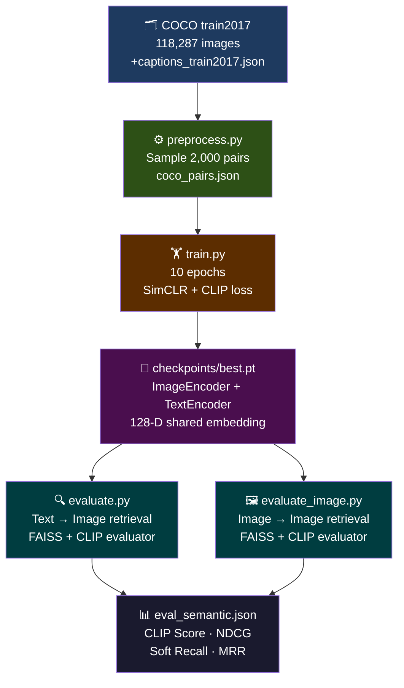

---

## 2. Data Preprocessing

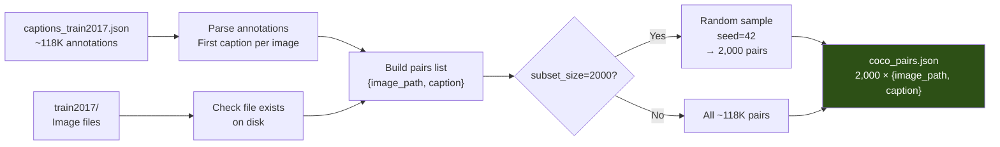

**Command:**
```powershell
python data/preprocess.py --subset_size 2000 --output data/coco_pairs.json
```

**Output format:**
```json
[
  { "image_path": "data/coco/train2017/000000123456.jpg",
    "caption":    "A dog sitting on a red couch." },
  ...
]
```

---

## 3. Model Architecture

### 3.1 Dual-Encoder Design

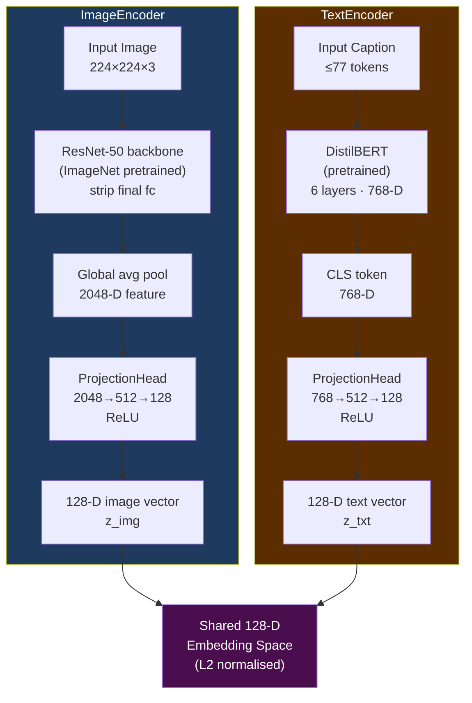

### 3.2 ProjectionHead (shared design)


---

## 4. Combined Loss Function

The model is trained with a **weighted sum of two losses**:

```
L_total = α · L_SimCLR  +  β · L_CLIP
        = 0.5 · L_SimCLR + 0.5 · L_CLIP
```

### 4.1 SimCLR Loss (image-image contrastive)

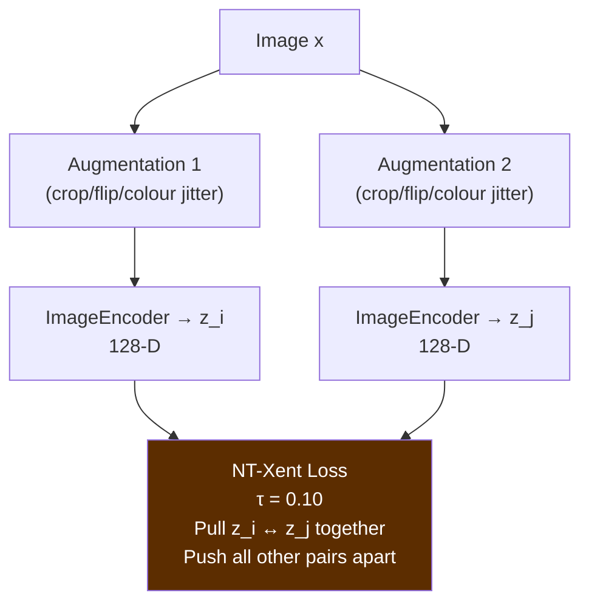

- Treats the two augmented views of the **same image** as positives.
- All other images in the batch (size=16) are negatives.
- Temperature τ = 0.10 (soft assignments).

### 4.2 CLIP Loss (image-text alignment)

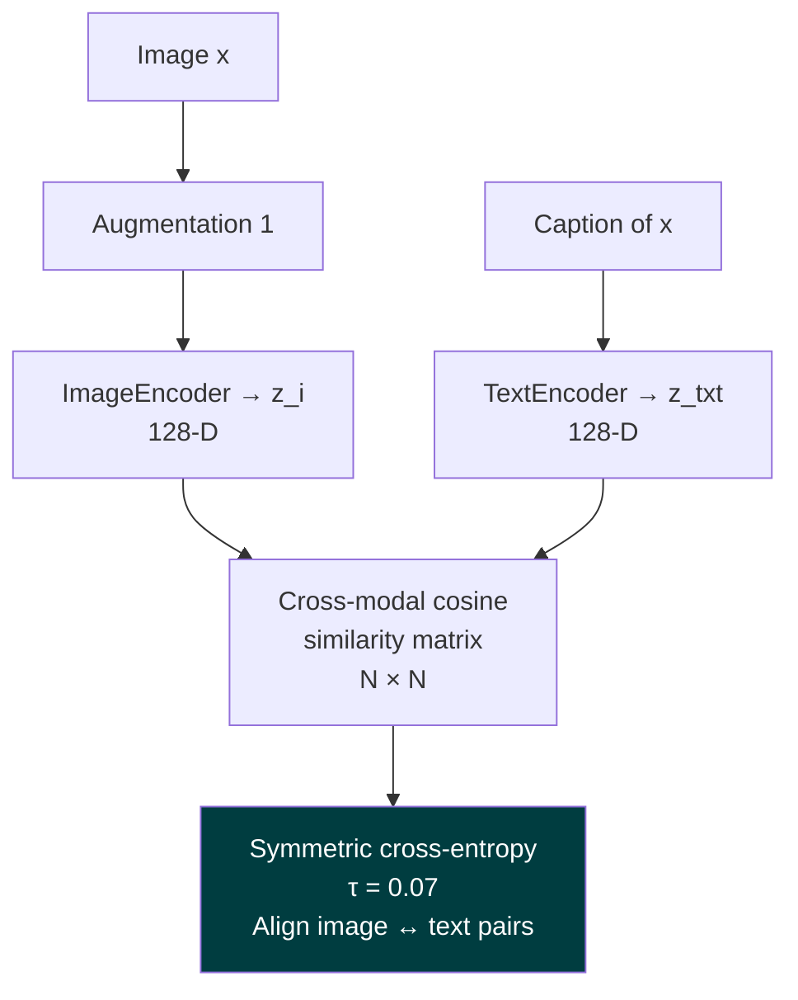

- The diagonal of the N×N similarity matrix holds positive pairs.
- Off-diagonal entries are negatives.
- Symmetric: both image-to-text and text-to-image directions are optimised.

### 4.3 Loss Computation Graph (one batch)

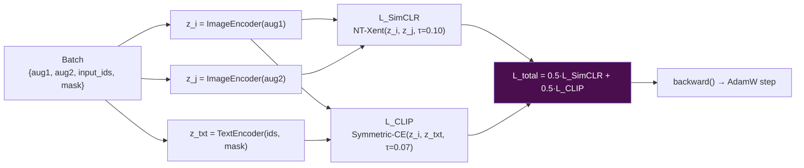

---

## 5. Training Pipeline

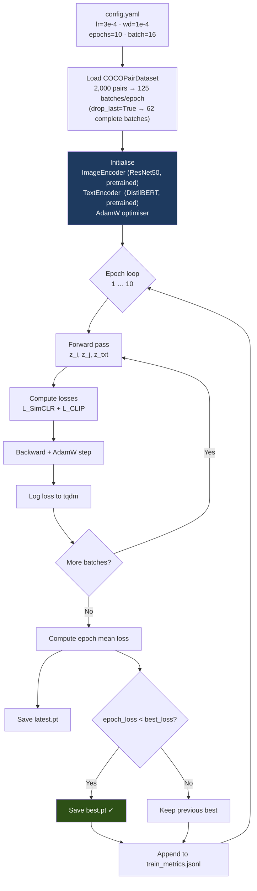

**Training config (config.yaml):**

| Parameter | Value |
|---|---|
| `embedding_dim` | 128 |
| `image_backbone` | resnet50 |
| `text_backbone` | distilbert-base-uncased |
| `batch_size` | 16 |
| `epochs` | 10 |
| `lr` | 3e-4 |
| `weight_decay` | 1e-4 |
| `α` (SimCLR weight) | 0.5 |
| `β` (CLIP weight) | 0.5 |
| `simclr_temperature` | 0.10 |
| `clip_temperature` | 0.07 |

---

## 6. Training Convergence

### 6.1 Epoch-by-epoch metrics

| Epoch | Total Loss | SimCLR Loss | CLIP Loss | Δ Loss |
|:---:|:---:|:---:|:---:|:---:|
| 1 | 1.4607 | 0.6779 | 2.2435 | — |
| 2 | 0.8814 | 0.3818 | 1.3809 | −0.579 |
| 3 | 0.7463 | 0.3459 | 1.1467 | −0.135 |
| 4 | 0.6515 | 0.3175 | 0.9855 | −0.095 |
| 5 | 0.5148 | 0.2621 | 0.7674 | −0.137 |
| 6 | 0.4525 | 0.2661 | 0.6388 | −0.062 |
| 7 | 0.4137 | 0.2384 | 0.5891 | −0.039 |
| 8 | 0.4032 | 0.2529 | 0.5536 | −0.010 |
| 9 | 0.3468 | 0.2093 | 0.4843 | −0.056 |
| **10** | **0.3195** | **0.1998** | **0.4393** | **−0.027** |

### 6.2 Loss curve

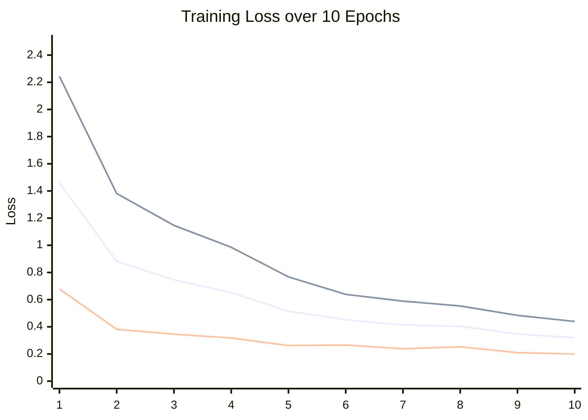

> Total loss dropped **78.1%** from epoch 1 (1.46) to epoch 10 (0.32).  
> Best checkpoint saved at **epoch 10** → `checkpoints/best.pt`.

---

## 7. Retrieval Pipeline (FAISS)

### 7.1 Gallery indexing (offline, done once)


### 7.2 Query → retrieval (online, per query)

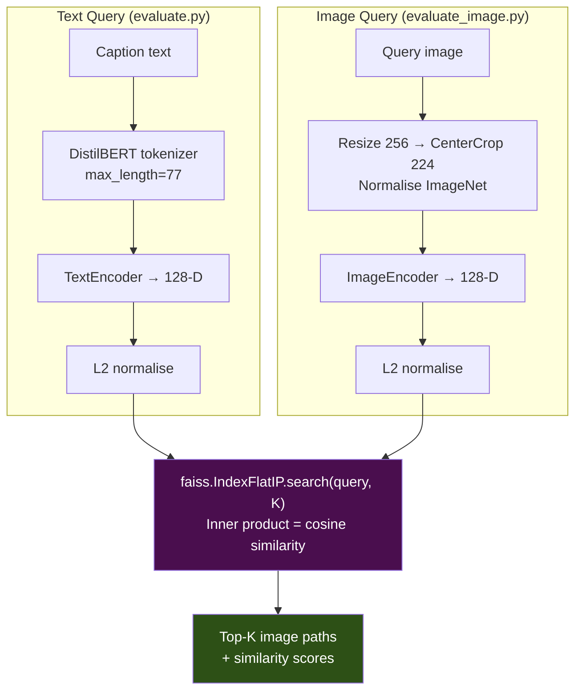

---

## 8. Evaluation Pipeline

### 8.1 Two-model design

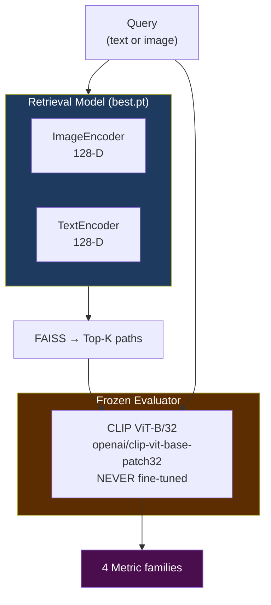

### 8.2 Per-query metric computation

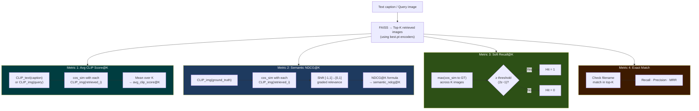

---

## 9. Text-to-Image Results

**Setup:** 50 queries · top_k=5 · ε=0.80 · COCO val2017 (5,000 gallery images)

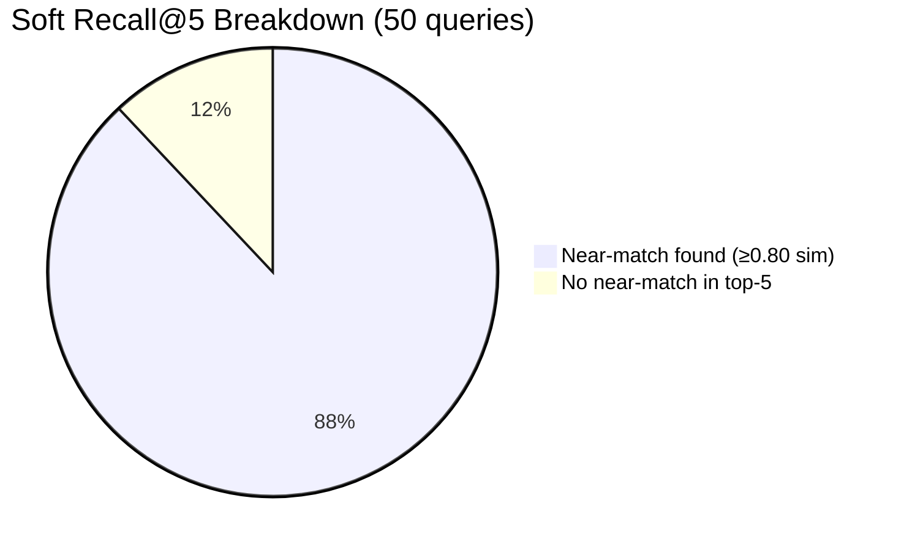

### 9.1 Results table

| Metric | Value | Meaning |
|---|---|---|
| `avg_clip_score@5` | **0.2478** | Retrieved images are semantically related to the caption |
| `semantic_ndcg@5` | **0.9862** | Near-perfect semantic ranking — correct images rank highest |
| `soft_recall@5` | **0.8800** | 88% of queries returned a visually similar image |
| `exact_recall@5` | 0.1000 | 10% found the exact ground-truth file (expected low: 1-in-5000) |
| `exact_precision@5` | 0.0200 | Binary baseline |
| `mrr@5` | 0.0450 | Exact hits appear near rank 4–5 when they do occur |

### 9.2 Key insight — semantic gap

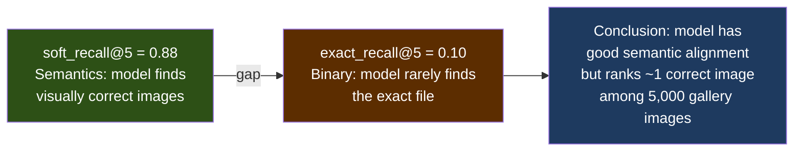

> The 78-point gap between soft and exact recall confirms the model retrieves **semantically correct** images even when it misses the exact file — which is the intended behaviour of a multimodal retrieval system.

### 9.3 Per-K recall breakdown

| K | Recall@K | Precision@K |
|:---:|:---:|:---:|
| 1 | 0.020 | 0.020 |
| 3 | 0.080 | 0.027 |
| 5 | 0.100 | 0.020 |

---

## 10. File Structure

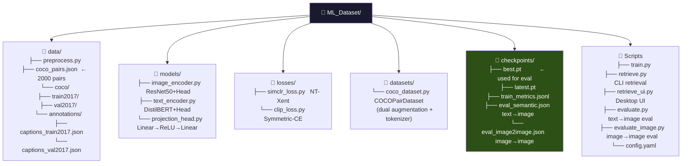

---

## Quick-Start Commands

```powershell
# 1. Preprocess
python data/preprocess.py --subset_size 2000 --output data/coco_pairs.json

# 2. Train
python train.py --config config.yaml

# 3. Text → Image evaluation
python evaluate.py --checkpoint checkpoints/best.pt --num_queries 1000 --top_k 5

# 4. Image → Image evaluation (hard mode)
python evaluate_image.py --checkpoint checkpoints/best.pt --num_queries 500 --top_k 5

# 5. Image → Image evaluation (self-retrieval)
python evaluate_image.py --checkpoint checkpoints/best.pt --keep_query_in_gallery --top_k 1

# 6. CLI retrieval
python retrieve.py --checkpoint checkpoints/best.pt --image_dir data/coco/val2017 --query_text "a dog on a beach"
```
